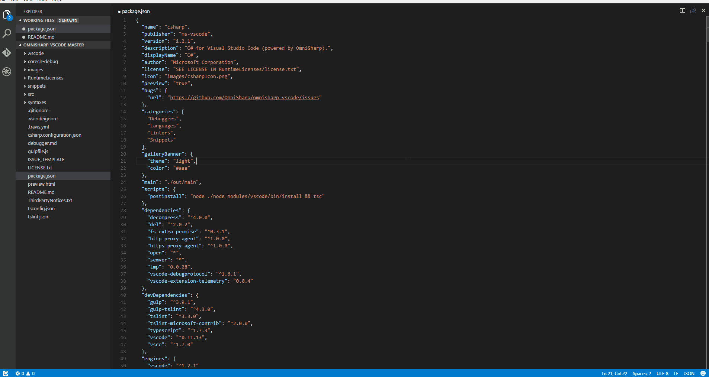

# Extension Manifest Editor

This extension lets you preview the details page for your extension from within Visual Studio Code. Use it to add rich content to your manifest and readme files and see how your extension will appear on the Marketplace. Features include:

- Side by Side Preview
- Standalone Preview
- Live Editing 

### Side Preview with Live Editing

### Standalone Preview

## Usage
Open the manifest file for your extension (`package.json` for Visual Studio Code extensions and `vsc-extension.json` for Team Services extensions).
- For side by side preview, either use the keybinding `ctrl+q y` or Press `F1`, type `side preview of details page` and hit return
- For standalone preview, either use the keybinding `ctrl+shift+y` or Press `F1`, type `standalone preview of details page` and hit return

